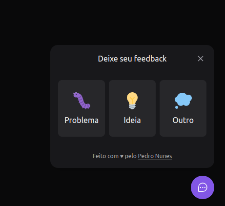
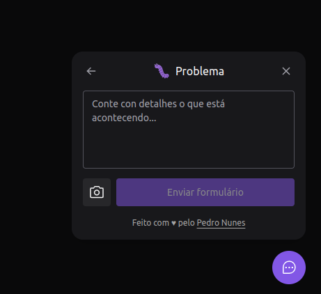

# nlw-return-impulse
## NLW Return Impulse

    
Nesta edição foi criado um projeto chamado FeedGet, com o intuito de enviar feedbacks sobre um problema, uma ideia ou qualquer outro assunto, para o proprietário de uma aplicação. Sendo possível fazer uma descrição, tirar um print da tela e enviar este feedback para o e-mail e banco de dados.
    

    

        <h3>Tencologias utilizadas:</h3>
            

                
                
                
                
                
                
                
                
                
            

            <small>Dentre essas tecnologias foram utilizadas várias outras bibliotecas que auxiliam no desenvolvimento.</small>
    
 
    

        <h3>Front-end:</h3>
        

            
            
        

    

